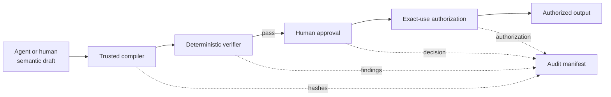

# Provable Agent Reference Framework

[](https://github.com/DigiTrans-App/provable-agent-reference/actions/workflows/validate.yml)
[](https://github.com/DigiTrans-App/provable-agent-reference/releases)
[](https://github.com/DigiTrans-App/provable-agent-reference/actions/workflows/codeql.yml)
[](https://github.com/DigiTrans-App/provable-agent-reference/actions/workflows/scorecard.yml)
[](LICENSE)
[](pyproject.toml)

The **Provable Agent Reference Framework** is an open-source, provider-neutral reference for building AI-agent workflows whose consequential outputs can be independently verified.

The central rule is simple:

> A model may propose meaning. Trusted software must construct identity, evidence bindings, verification, approval, authorization, and audit history.

Instead of treating model output as authoritative, the framework accepts a bounded semantic draft and then performs a deterministic control sequence:

1. resolve evidence from a trusted, scoped bundle;
2. compile a canonical candidate in trusted code;
3. verify evidence, scope, disclosure, and integrity rules;
4. bind an accountable human decision to the exact candidate hash;
5. authorize one exact purpose, audience, and output;
6. reconstruct and verify a tamper-evident audit manifest.



## What is open source

This repository contains generic, reusable building blocks:

- semantic agent contracts;
- trusted compilation;
- evidence-bundle formats;
- deterministic verification primitives;
- human-approval records;
- exact-use authorization;
- audit reconstruction and tamper detection;
- synthetic examples, adversarial tests, and local evaluations;
- an optional OpenAI Agents SDK example;
- an experimental privacy-minimized Codex evidence adapter;
- a documented Codex contributor workflow.

## What is not in this repository

This repository does **not** contain the DigiTrust hosted platform, enterprise orchestration, customer-specific workflows, managed evidence operations, commercial integrations, SaaS administration, customer data, production infrastructure, or a private product roadmap. See [Open-source boundary](docs/open-source-boundary.md).

## Release

The current release is **v0.2.0**, which adds a versioned runtime-adapter boundary, the experimental Codex Evidence Adapter, offline OpenAI Agents SDK compatibility validation, repository security automation, and validated GitHub release artifacts.

Review the complete [v0.2.0 release notes](docs/releases/v0.2.0.md). GitHub Releases publish a wheel, source distribution, machine-readable artifact manifest, and SHA-256 checksum file. The package is not currently published to PyPI.

## Independent validation

External reviewers can validate a checkout that contains the kit and generate a privacy-bounded machine-readable report:

```bash
python -m pip install -e '.[dev,openai]'
EXPECTED_COMMIT="$(git rev-parse HEAD)"
python scripts/run_external_validation.py \
  --expected-commit "${EXPECTED_COMMIT}"
```

The runner records Git provenance, environment metadata, bounded sanitized output summaries, test and evaluation results, and optional release-artifact checks. A passing report is a reproducibility signal, not certification, source authentication, or proof that a deployment is secure.

The `v0.2.0` tag predates the validation-kit files. To evaluate that immutable release, use one current validator checkout and one separate `v0.2.0` target checkout as documented in the [independent validation guide](docs/independent-validation.md). Also review the [human report template](docs/validation-report-template.md) and the [machine-readable report schema](schemas/independent-validation-report.schema.json). Critical, negative, and incomplete results are welcome when they include a synthetic reproduction and clear trust-boundary impact.

## Quick start

```bash
python -m venv .venv
source .venv/bin/activate  # Windows: .venv\Scripts\activate
python -m pip install -e '.[dev]'
python -m unittest discover -s tests -v
python scripts/validate_repo.py
python -m provable_agent_reference
```

The final command runs a fully local synthetic assurance workflow. It makes no network request and requires no API key.

## Minimal example

```python
from provable_agent_reference import (
    EvidenceBundle,
    EvidenceRecord,
    ProvableAgentPipeline,
    SemanticDraft,
    TrustedRunContext,
)

context = TrustedRunContext(
    tenant_id="tenant_demo",
    case_id="case_demo",
    run_id="run_demo",
    agent_id="agent_demo",
    purpose="Prepare a synthetic assurance statement.",
    audience="security reviewer",
    classification="internal",
    created_at="2026-01-01T00:00:00Z",
)

evidence = EvidenceRecord.from_text(
    evidence_id="evidence_control_001",
    tenant_id=context.tenant_id,
    case_id=context.case_id,
    text="Synthetic control test completed successfully.",
    source_uri="synthetic://control-test/001",
    classification="internal",
    summary="Synthetic control-test evidence.",
)

bundle = EvidenceBundle.create(
    bundle_id="bundle_demo",
    tenant_id=context.tenant_id,
    case_id=context.case_id,
    records=[evidence],
)

draft = SemanticDraft(
    claim_text="The synthetic control was tested.",
    selected_evidence_id=evidence.evidence_id,
    limitations=("Synthetic evidence only.",),
    assurance_statement="A synthetic control test was completed.",
    content_categories=(),
    redacted=False,
)

result = ProvableAgentPipeline().run(
    context=context,
    draft=draft,
    evidence_bundle=bundle,
    approver_id="human_reviewer",
)

assert result.authorization.authorized
assert result.audit_valid
```

## OpenAI Agents SDK example

The core framework is provider-neutral and has no runtime dependency on any model provider. An optional Agents SDK example is available in [`examples/openai_agents_sdk`](examples/openai_agents_sdk/README.md). It shows how a model can be limited to a semantic draft while authoritative controls remain in local trusted code.

The optional example is not required for the deterministic test suite and does not imply OpenAI endorsement or certification.

## Codex Evidence Adapter

The experimental [`CodexEvidenceAdapter`](docs/codex-evidence-adapter.md) converts synthetic `codex exec --json` events and `codex_otel.agent_communication` telemetry into scoped, deterministic evidence records. Raw prompts, commands, paths, tool payloads, identifiers, outputs, and multi-agent message content are not retained; relevant values are hash-bound instead.

The hashes are integrity references, not anonymization. Review the adapter documentation before using the pattern with sensitive production data.

Run the fully local compatibility example:

```bash
python examples/codex_evidence_adapter/run.py
```

The adapter reports unavailable evidence rather than reconstructing it heuristically. It is a downstream community integration and does not imply OpenAI endorsement, certification, sponsorship, or review.

## Repository map

```text
src/provable_agent_reference/            Provider-neutral core library
src/provable_agent_reference/adapters/   Optional runtime adapters
schemas/                                 Machine-readable contracts
examples/                                Synthetic and provider examples
evals/                                   Local adversarial evaluation harness
docs/                                    Architecture, threat model, and governance
scripts/                                 Repository and external validation tools
tests/                                   Deterministic unit and integration tests
```

## Security status

This is a reference implementation, not a production security product. The cryptographic operations use standard SHA-256 hashing for deterministic record binding, not a production identity, signature, key-management, or attestation system. Automated CodeQL, dependency-review, and OpenSSF Scorecard workflows provide additional triage signals but do not constitute certification. Review [SECURITY.md](SECURITY.md) and the [threat model](docs/threat-model.md) before reuse.

## Contributing

Contributions and independent technical reviews are welcome. Start with [CONTRIBUTING.md](CONTRIBUTING.md), the [roadmap](ROADMAP.md), and issues labeled `good first issue` or `help wanted`.

## License

Apache License 2.0. See [LICENSE](LICENSE) and [NOTICE](NOTICE).
