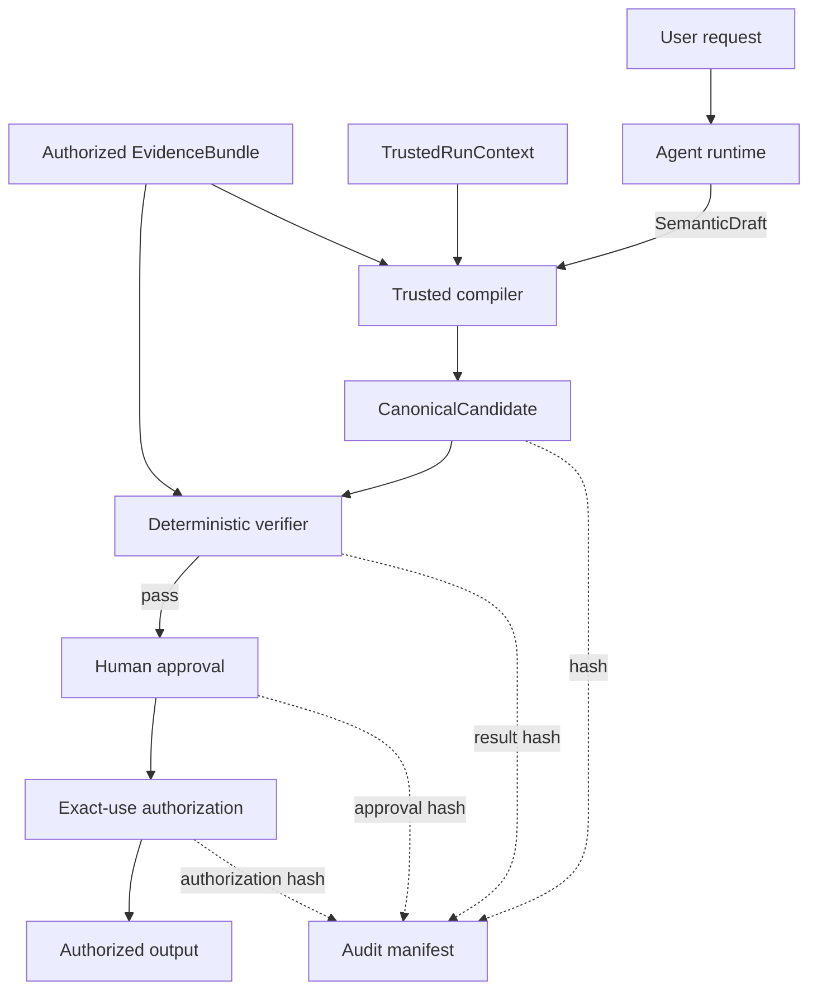
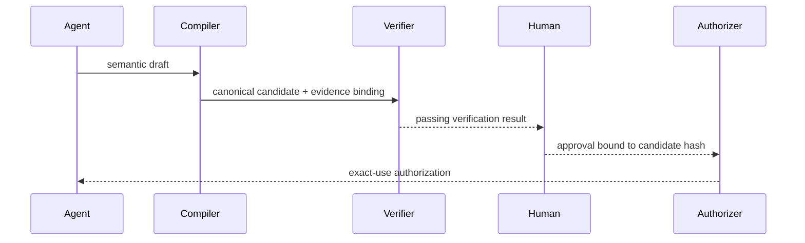

# Architecture

The framework separates semantic generation from authoritative controls.

## Data flow

1. A model or human produces a `SemanticDraft`.
2. A trusted runtime supplies `TrustedRunContext` and an `EvidenceBundle`.
3. `TrustedCompiler` resolves the selected evidence and derives the canonical candidate identifiers and hashes.
4. `DeterministicVerifier` evaluates integrity, evidence, scope, disclosure, and limitation rules.
5. A human decision is bound to the exact candidate and verification hash.
6. `authorize_exact_use` compares purpose, audience, and exact output.
7. `build_audit_manifest` binds the complete control chain.

## Design characteristics

- **Provider-neutral:** core contracts do not require a model SDK.
- **Fail closed:** verification failure cannot produce approval.
- **Deterministic:** canonical JSON and SHA-256 produce stable bindings.
- **Minimal model authority:** models select evidence identifiers and draft semantic content only.
- **Exact-use control:** approved content cannot be silently repurposed or substituted.
- **Auditable:** a manifest reconstructs candidate, verification, approval, and authorization relationships.

## Reference versus production

The reference uses deterministic hashes and in-memory objects. A production deployment should add authenticated identities, durable append-only storage, trusted timestamps, KMS/HSM-backed signatures, policy governance, access controls, monitoring, retention, and independent operational review.
