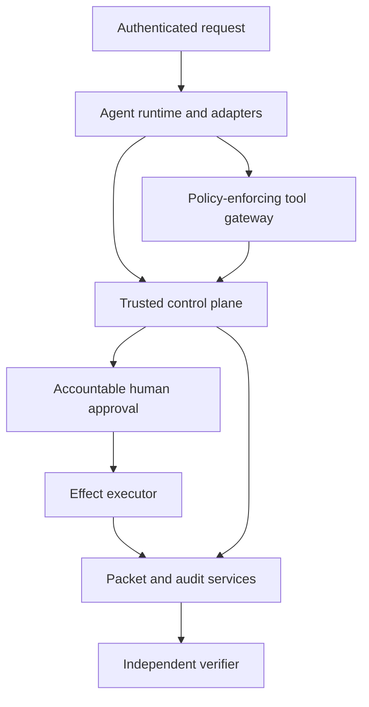
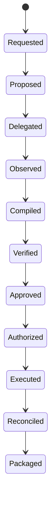

# Full agentic reference architecture

Status: **informative Phase 0 proposal**.

## Design objective

Make consequential agent activity reconstructable and independently reviewable without
trusting model output, a provider's event vocabulary, or the application that assembled the
assurance packet.

The architecture controls authority and evidence around the agent. It does not attempt to
prove hidden reasoning or guarantee that generated content is true.

## Actors

| Actor | Trusted role | Untrusted or limited role |
|---|---|---|
| Requesting human/system | Authenticated request identity and approved scope | Free-form goal text |
| Orchestrator agent | None by virtue of model output | Proposes plan, delegation, evidence selection, and output |
| Specialist/sub-agent | None by virtue of model output | Performs a scoped delegated task |
| Agent runtime adapter | Normalizes bounded observations when authenticated | Provider events and payloads remain untrusted inputs |
| Tool gateway | Enforces capabilities, policy, idempotency, and event correlation | Tool descriptions and remote responses may be hostile |
| Evidence resolver | Resolves authorized records inside tenant/case scope | Does not infer unavailable evidence |
| Trusted control plane | Compiles, verifies, approves, authorizes, signs, and reconstructs | Must not delegate authoritative decisions to the model |
| Human approver | Authenticated decision bound to exact records | Display name or model-provided identity is insufficient |
| Effect executor | Emits one authorized external action and returns a receipt | Provider receipt is evidence, not automatically proof |
| Independent verifier | Recomputes supported profiles and reports limitations | Does not trust producer-supplied success claims |

## Logical architecture

The boxes are logical boundaries. A development deployment may combine them in one process.
A separated deployment assigns independent workload identities, network policy, storage access,
and scaling controls.

## Agentic activity model

Every activity record has a trusted envelope and a type-specific body. The envelope links the
event to tenant, case, run, parent run, actor, sequence, policy version, time source, and prior
event. The body contains the minimum information needed for verification.

Candidate activity types are:

| Activity | Minimum accountability evidence |
|---|---|
| Work request | Authenticated requester, purpose, audience, risk tier, allowed capabilities |
| Proposal | Structured goal, selected evidence references, limitations, proposed next action |
| Delegation | Parent/child identities, delegated task, capability subset, budget, expiry |
| Model invocation | Provider/model identifiers, configuration digest, input/output digests, usage; no chain-of-thought |
| Memory access | Store identity, query digest, authorized scope, result-reference digests, minimization decision |
| Tool request | Tool identity/version, canonical arguments or digest, capability grant, idempotency key |
| Tool result | Correlation ID, bounded result or digest, provider identity, error and completeness status |
| Policy decision | Policy bundle/version, decision, obligations, evaluated subject/action/resource/context |
| Human decision | Authenticated approver, exact record hashes, decision, rationale, expiry |
| Authorization | Exact purpose, audience, output/effect, limits, validity, single/multiple-use semantics |
| Execution receipt | Executor identity, authorized action hash, provider receipt, observed status, time |
| Reconciliation | Intended versus observed effect, discrepancies, compensating action |
| Revocation/supersession | Target record, reason, authority, effective time, successor reference |

## Authority flow

An agent receives capabilities; it does not inherit ambient authority. Delegation can only
narrow the parent's capabilities, data scope, budget, validity, and allowed effects. A child
cannot create authority for its parent or siblings.

A tool request is not authorization. The gateway evaluates policy and produces a decision
record before invoking a consequential tool. High-risk actions additionally require a human
decision bound to the exact request and evidence state.

## Lifecycle overlay

The normative v0.3 lifecycle remains controlling through `reconstructed`. A full agentic
implementation also needs activity before compilation and evidence after authorization:

`requested`, `proposed`, `delegated`, `observed`, `executed`, `reconciled`, and `packaged` are
informative names until separately standardized. Failed, rejected, expired, revoked, and
superseded records preserve history instead of overwriting it.

## Mandatory invariants

1. Trusted identity, scope, policy, time, and authority never originate in model output.
2. Every child run names one authenticated parent and can only receive a strict capability
   subset.
3. Provider events and tool results are untrusted until normalized and bound to a trusted
   run context.
4. A consequential effect requires an exact authorization; a successful API response requires
   a separately recorded receipt and reconciliation.
5. Retries reuse an idempotency key and cannot silently create a second effect.
6. A material mutation invalidates all dependent decisions and packets.
7. Missing, incomplete, or unverifiable evidence is reported explicitly.
8. Secrets, bearer credentials, unrestricted payloads, and private chain-of-thought are not
   evidence artifacts.
9. Human approval is authenticated, attributable, time-bound, and independent where the
   claimed profile requires separation of duties.
10. Every assurance claim names a supported profile and preserves its limitations.

## Memory and privacy

Memory is treated as a scoped evidence source, not trusted cognition. The default record stores
the authorized store, query digest, returned reference digests, classification, and policy
decision. Raw retrieved content is included only when required and permitted by retention and
disclosure policy.

Telemetry uses allowlisted fields. Prompts, raw tool payloads, secrets, personal data, and model
reasoning are excluded by default. Hashes are integrity references and must not be represented
as anonymization.

## Risk tiers

| Tier | Example | Minimum control |
|---|---|---|
| 0: observe | Read synthetic public data | Authenticated run, bounded logging |
| 1: prepare | Draft an internal document | Evidence binding and deterministic verification |
| 2: recommend | Produce a consequential recommendation | Human review and exact-use authorization |
| 3: act | Send, change, purchase, approve, or deploy | Human approval, single-use effect authorization, receipt, reconciliation |
| 4: restricted | Safety-critical or legally prohibited autonomy | Deny by default; require a separately governed system and legal/security approval |

The reference workflow should exercise Tier 3 with synthetic targets. No production action is
enabled by the reference configuration.

## Deployment patterns

- **Embedded modular:** one process, separate modules and stores; suitable for evaluation.
- **Separated control plane:** independently authenticated services; preferred enterprise
  reference.
- **Offline exchange:** packet producer and verifier operated by different organizations.
- **Federated:** multiple organizations issue and verify packets using explicitly configured
  trust anchors; a future profile, not a Phase 1 requirement.

## What this can become

The architecture can support independently verifiable agent transactions across providers,
organizations, and regulated workflows. With signatures, receipts, revocation, conformance,
and operational evidence, it can become a shared assurance layer for agent ecosystems.

It cannot, by architecture alone, prove model truthfulness, evidence completeness, human
intent, correct real-world outcomes, or regulatory compliance. Those remain explicit trust
assumptions and deployment responsibilities.
