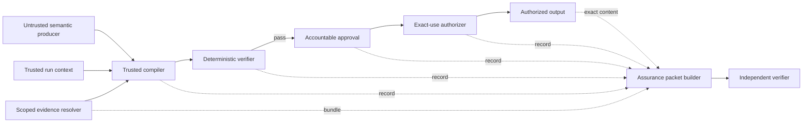

# Provable Agent Reference Architecture Candidate

Status: **candidate**, protocol version `0.3.0-candidate.1`.

This document separates the project into a provider-neutral architecture and protocol, a
Python reference implementation, runtime adapters, and an independent conformance model.
The candidate is published for review and interoperability testing. It is not a standard,
certification, production-security claim, or evidence that a deployment is trustworthy.

## North-star property

An agent workflow can produce a portable assurance packet that an independent verifier can
evaluate offline without trusting model output, provider-specific event semantics, or the
application that assembled the packet.

The verifier still relies on the packet's declared trust anchors and assumptions. Hash
bindings detect substitution; they do not prove source authenticity, evidence completeness,
human identity, trusted time, or correct execution of an external runtime.

## Project layers

| Layer | Authority | Responsibility |
|---|---|---|
| Reference architecture | Provider neutral | Components, trust boundaries, lifecycle, and deployment patterns |
| Protocol candidate | Normative | Records, canonicalization, bindings, state transitions, profiles, and failure behavior |
| Python reference implementation | Informative except where tested against the protocol | One executable implementation of the protocol |
| Runtime adapters | Provider specific and untrusted at the core boundary | Translate bounded runtime observations into evidence inputs |
| Conformance kit | Independent evaluation | Schemas, vectors, mutation tests, reports, and profile verification |

An implementation can conform without using the Python package. An adapter cannot redefine
trusted fields or weaken a protocol invariant.

## Logical components

### Semantic producer

Proposes bounded meaning. It is not authoritative for identity, scope, evidence integrity,
verification, approval, authorization, lifecycle state, or audit claims.

### Trusted compiler

Resolves selected evidence in a trusted scope and constructs an unambiguous canonical
candidate. It derives identifiers and hashes in deterministic code.

### Deterministic verifier

Recomputes candidate and evidence bindings and evaluates explicit rules. A failed verification
cannot transition to approval.

### Accountable approval

Binds a human decision to the exact candidate and verification result. The reference governed
profile requires the approver identifier to differ from the agent identifier. Production
identity proofing remains outside the reference implementation.

### Exact-use authorizer

Binds authorization to the candidate, approval, purpose, audience, and exact canonical output.
An authorized output is carried in the assurance packet so an offline verifier can recompute
the output binding.

### Assurance packet builder and independent verifier

The builder packages the reconstructable authorized control chain. The verifier recomputes every available hash
and cross-record binding and reports failures without upgrading unavailable evidence into a
positive claim.

## Required trust-boundary rules

1. Trusted identity and scope MUST NOT be copied from model output.
2. Provider events MUST remain untrusted until a bounded adapter normalizes them.
3. Missing evidence MUST be reported as unavailable or partial, not inferred.
4. Every transition MUST validate the complete prerequisite record and its bindings.
5. A material mutation MUST invalidate all downstream approvals, authorizations, manifests,
   and packets bound to the mutated record.
6. Conformance claims MUST use a versioned profile identifier and MUST NOT claim future
   cryptographic properties that the implementation does not verify.
7. Verification output MUST preserve limitations and non-properties.

## Deployment patterns

The same protocol can be used in three patterns:

- **Embedded:** compiler, verifier, and authorizer execute in one trusted application boundary.
- **Separated control plane:** trusted controls are services with independently authenticated
  identities and durable records.
- **Offline exchange:** a producer exports a packet and a separate organization verifies it.

The embedded reference demonstrates protocol behavior. It does not model production isolation,
storage, key custody, identity proofing, availability, or incident response.

## Candidate specification

- [Specification index](spec/README.md)
- [Lifecycle state machine](spec/lifecycle.md)
- [Assurance Packet candidate](spec/assurance-packet.md)
- [Conformance profiles](spec/conformance-profiles.md)
- [Normative change process](change-process.md)

The existing [threat model](threat-model.md), [trust boundary](trust-boundary.md), and
[independent validation guide](independent-validation.md) remain controlling context for
reviewing this candidate.
