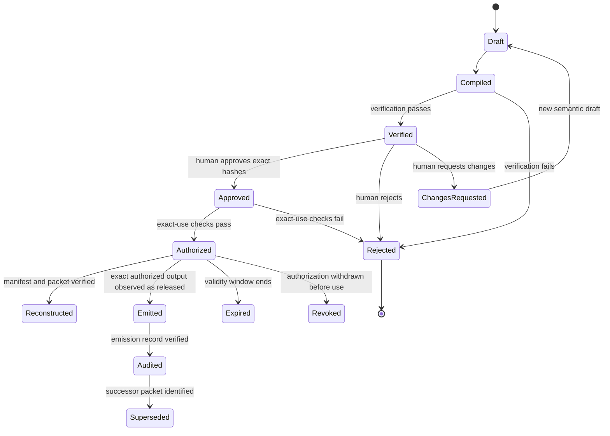

# Lifecycle state machine

Status: normative candidate for `0.3.0-candidate.1`.

## States

`Emitted`, `Audited`, `Expired`, `Revoked`, and `Superseded` are normative architecture states.
The current Python reference constructs packets only for a successfully `Reconstructed` state;
it does not claim that the output was externally emitted or consumed, and it does not yet
implement durable emission, expiry, revocation, or supersession records.

## Transition requirements

| Transition | Required condition | Failure behavior |
|---|---|---|
| Draft → Compiled | Trusted scope and selected evidence resolve exactly | Reject compilation |
| Compiled → Verified | Candidate, evidence, scope, disclosure, and rule checks pass | Produce failed verification; no approval path |
| Verified → Approved | Decision binds exact candidate and passing verification hashes | Reject approval |
| Approved → Authorized | Candidate, approval, purpose, audience, and output all match | Produce unauthorized result |
| Authorized → Reconstructed | All available hashes, output, and cross-record bindings reconstruct successfully | Report invalid packet |
| Authorized → Emitted | Released bytes equal the authorized canonical output | Do not claim emission |
| Emitted → Audited | A bound emission record and complete control chain verify | Do not claim audited emission |

An implementation MUST NOT skip a transition or infer a later state from the presence of an
identifier alone.

## Invalidation

A change to a trusted field or hash input invalidates the changed record and every downstream
record. In particular:

- recompilation invalidates verification, approval, authorization, emission, and audit records;
- a new verification invalidates approval and every later state;
- an approval change invalidates authorization and every later state;
- a purpose, audience, or output change requires a new authorization;
- an evidence-bundle mutation requires recompilation;
- a protocol or canonicalization change requires explicit version migration.

Downstream records MUST NOT be silently rebound to a changed predecessor.

## Idempotency and retry

Repeating a deterministic transition with identical versioned inputs SHOULD produce identical
content bindings. A retry MUST NOT create a second authorization use where the deployment
defines authorization as single-use. Durable consumption and idempotency controls are a
production responsibility until a versioned consumption record is added to the protocol.

## Terminal and future states

`Rejected` is terminal for the exact candidate. `ChangesRequested` requires a new draft and
therefore a new candidate identity. `Expired`, `Revoked`, and `Superseded` MUST preserve the
original record and add a bound successor record; history MUST NOT be rewritten.
